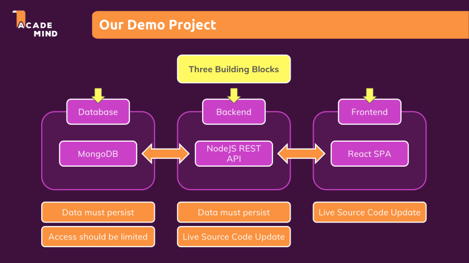

# 섹션 3 - 데이터 관리 및 볼륨

## Docker에서 데이터(Data)란 무엇인가?

**Docker** 환경에서  데이터는 총 3가지로 나눌 수 있습니다.\
\
1\. **Application (Code + Environmnet)  Data** \
2\. **Temporary App data** \
3\. **Permanent App data**\
\
이렇게 3가지로 나눌 수 있습니다.

***

**1. Application Data (애플리케이션 데이터)**

**Application Data** 는 **개발자**가 작성한 **Code** + 설정한 환경 즉 Environment 로 구성되어있는 **`Image파일`** 을 말하는 것 입니다. Image 파일의 특징으로써는 Read Only 이기 때문에 수정하기 위해서는 해당 Image 파일을 다시 빌드 해야합니다.

<figure><figcaption></figcaption></figure>

<figure><figcaption></figcaption></figure>

***

**2. Temporary App Data (임시 애플리케이션 데이터)**

Temporary App Data는 런타임 시점에 생성되는 데이터, 예를 들어 객체와 같은 임시 데이터를 말합니다. 이 데이터는 메모리에 저장되며, Read-Only인 이미지와 달리 **컨테이너(Container)** 계층에서 생성됩니다. 하지만 **휘발성(Volatile)** 특성을 가지므로, 컨테이너가 종료되면 이 데이터도 함께 사라집니다.

<figure><figcaption></figcaption></figure>

<figure><figcaption></figcaption></figure>

***

**3. Permanent App Data (영구 애플리케이션 데이터)**

마지막으로 **Permanent App Data** 입니다.\
말 그대로 **영구적인 데이터**를 의미합니다 해당 데이터는 사용자가 등록한 데이터들을 의미합니다\
**데이터베이스에 저장되는 데이터**들과 같은 데이터를 이야기하는 것 입니다.\
컨테이너가 삭제되었을 경우 해당 데이터들은 컨테이너와 무관하게 영구적으로 저장이 되어야 하는데요 하지만  생성되는 데이터들은 전부 컨테이너에 저장되는데 이때 **Volume**의 도움을 받게 됩니다.

<figure><figcaption></figcaption></figure>

***

## 볼륨(Volume) 이란?

위에서 언급 되었다시피 영구적인 데이터를 저장하기 위해서는 **볼륨(Volume)**&#xC758; 도움을 받아 저장하게 됩니다.

여기서 볼륨이 무엇인지 설명하도록 하겠습니다.\
볼륨은 **호스트 머신(Host Machine)**&#xC785;니다. 컴퓨터에 장착된 **하드 드라이브**에 존재하여 사용가능하거나, 컨테이너로 매핑되는 것을 의미합니다. 즉 **사용자 폴더**가 존재하며 해당 폴더는 **도커 컨테이너 내부의** **폴더와 매칭**됩니다.

볼륨은 컨테이너가 종료된 후에도 계속 지속되며 존재합니다. 그리고 컨테이너는 볼륨의 저장된 데이터를 읽고 쓸 수 있습니다.

<figure><figcaption></figcaption></figure>

### 볼륨의 종류

볼륨은 2가지의 종류가 존재합니다 **Anonymous Volumes 와 Named Volumes** 입니다.

**Anonymous Volumes**

<figure><figcaption>
<strong>Anonymous Volumes 특징</strong>
</figcaption></figure>

익명 볼륨(Anonymous Volume)은 **컨테이너에 종속적인 볼륨**으로, 컨테이너가 제거되면 해당 익명 볼륨도 함께 제거됩니다. 따라서 **익명 볼륨은 컨테이너 간에 데이터를 공유할 수 없으며**, 여러 컨테이너에서 같은 데이터를 활용하는 데는 적합하지 않습니다.

또한, **Docker는 익명 볼륨을 자동으로 임의의 경로에 생성**하기 때문에, 사용자가 직접 경로를 지정하거나 접근하는 데 어려움이 있을 수 있습니다. 이러한 특성으로 인해 익명 볼륨은 **컨테이너 생명주기와 연결되어 있기 때문에 임시 저장소로 사용되는 경우가 많습니다**.

#### Named Volumes

<figure><figcaption>
Named Volumes의 특징
</figcaption></figure>

명명된 볼륨(Named Volume)은 Docker에서 **지속적인 데이터 저장을 위해 사용되는 볼륨**으로, 사용자가 직접 이름을 지정하여 관리할 수 있습니다.

익명 볼륨과 달리, **컨테이너가 종료되거나 삭제되더라도 데이터가 유지**되며, 여러 컨테이너가 동일한 볼륨을 공유하여 데이터를 함께 사용할 수도 있습니다. 이러한 특징 덕분에 **데이터베이스, 로그 저장소 등 영구적인 데이터 관리가 필요한 환경에서 유용**하게 활용됩니다.

## Bind Mounts

<figure><figcaption>
Bind Mounts의 특징
</figcaption></figure>

바인드 마운트(Bind Mount)는 Docker 컨테이너에서 **호스트의 특정 디렉터리나 파일을 직접 컨테이너에 연결하는 방법**입니다. 이를 통해 컨테이너와 호스트 간 데이터를 공유할 수 있으며, 컨테이너가 삭제되더라도 데이터가 지속적으로 유지됩니다.

앞서 설명한 익명 볼륨(Anonymous Volume)이나 명명된 볼륨(Named Volume)과의 차이점은, **바인드 마운트는 호스트의 로컬 파일 시스템을 직접 매핑**하기 때문에 컨테이너 자체와는 독립적으로 존재한다는 점입니다. 따라서 컨테이너를 삭제해도 데이터가 유지되며, HTML, JavaScript와 같은 파일을 수정할 때 **이미지를 다시 빌드할 필요 없이 변경 사항을 즉시 반영**할 수 있습니다. 이는 특히 **웹 애플리케이션 개발 환경에서 실시간 코드 반영 및 디버깅**에 매우 유용합니다.

| 저장 방식                 | 지속성     | 위치                     | 주요 용도            |
| --------------------- | ------- | ---------------------- | ---------------- |
| **Anonymous Volumes** | 컨테이너 종속 | 호스트 디스크 (Docker 관리)    | 임시 데이터 저장        |
| **Named Volumes**     | 영구적     | 호스트 디스크 (Docker 관리)    | 데이터베이스, 로그 저장    |
| **Bind Mounts**       | 영구적     | 호스트 파일 시스템 (사용자 지정 경로) | 개발 환경, 실시간 파일 수정 |
