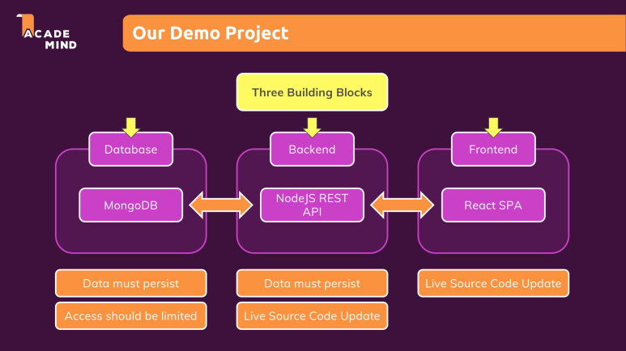

# 섹션 5 - Docker로 다중 컨테이너 애플리케이션 구축

> ## Target 앱 설정

프로젝트 기본 아키텍처

<figure><figcaption><p>프로젝트 기본 아키텍처</p></figcaption></figure>

현재 위와 같은 3개의 서비스가 존재합니다. 각 서비스는 Docker를 사용해 컨테이너화하여 운영할 예정입니다.

서비스별 요구사항을 아래와 같이 정리해보았습니다.

​

1. 데이터베이스 (MongoDB)
   * 데이터가 지속되어야 합니다.
   * 접근이 제한되어야 합니다.
   * 백엔드와 연결이 되어야 합니다.
2. 백엔드 (Node.js)
   * 데이터가 지속되어야 합니다.
   * 코드가 실시간으로 업데이트 되어야 합니다.
   * 데이터베이스와 프론트엔드와 연결되어야 합니다.
3. 프론트엔드
   * 코드가 실시간으로 업데이트 되어야 합니다.
   * 프론트엔드와 연결되어야 합니다.

​

각각의 서비스는 목적에 맞게 도커화하여 설정하고 운영해야 합니다.

> ## **MongoDB 서비스 도커화 하기**

MongoDB는 로컬에 설치된 파일을 이미지화하지 않고, Docker Hub에서 공식 이미지를 가져와서 사용합니다.

Docker Hub에 MongoDB 공식 이미지가 존재하므로, 이를 가져와서 실행할 수 있습니다. 다음과 같은 명령어로 MongoDB 컨테이너를 실행할 수 있습니다

```
docker run --name mongodb --rm -d -p 27017:27017 mongo
```

위 명령어는 mongo 이미지를 사용하여 MongoDB를 실행합니다. 이때 --rm 옵션은 컨테이너 종료 시 자동으로 컨테이너를 제거하는 옵션이고, -p 옵션은 로컬 포트와 컨테이너의 포트를 매핑하는 옵션입니다.

​

> ## Node 앱 도커화 하기

Node.js 앱의 경우, 공식 이미지는 존재하지만, 우리가 작성한 코드와 커스텀된 설정이 있기 때문에 Dockerfile을 사용하여 이미지를 직접 빌드해야 합니다. 아래는 Dockerfile 예시입니다

```
FROM node
WORKDIR /app 
COPY package.json . 
RUN npm install 
COPY . . 
EXPOSE 80 
CMD ["node","app.js"]
```

이 Dockerfile을 통해 이미지를 빌드하려면 다음 명령어를 실행합니다

```
docker build -t goals-backend .
```

이 명령어는 현재 디렉토리에서 Dockerfile을 읽고 이미지를 빌드합니다.

빌드된 이미지를 바탕으로 컨테이너를 실행할 수 있습니다.

```
docker run --name goals-backend --rm goals-node
```

> ## MongoDB 연결 문제 해결

하지만 위 명령어로 Node.js 앱을 실행하면, MongoDB와 연결할 때 문제가 발생할 수 있습니다. 구체적으로, mongoose.connect()에서 사용하는 MongoDB 주소가 localhost로 되어 있기 때문에, 컨테이너 내에서 localhost를 찾을 수 없어 연결이 되지 않습니다. 아래와 같은 오류가 발생할 수 있습니다

```
FAILED TO CONNECT TO
```

```docker
mongoose.connect(
  'mongodb://localhost:27017/course-goals',
  {
    useNewUrlParser: true,
    useUnifiedTopology: true,
  },
  (err) => {
    if (err) {
      console.error('FAILED TO CONNECT TO MONGODB');
      console.error(err);
    } else {
      console.log('CONNECTED TO MONGODB');
      app.listen(80);
    }
  }
);
```

이 문제의 원인은 MongoDB 컨테이너와 Node.js 앱이 각기 다른 컨테이너에서 실행되고 있기 때문입니다.

localhost는 각 컨테이너 내에서만 유효한 주소이고,

두 컨테이너는 서로 다른 네트워크 상에 있기 때문에 직접적으로 localhost로 연결할 수 없습니다.

​

따라서, **host.docker.internal**을 사용하면 이 문제를 해결할 수 있습니다. **host.docker.internal**은 Docker 컨테이너 내에서 호스트 머신에 접근할 수 있는 특수한 주소입니다.

이를 MongoDB 연결 문자열에 반영하면, 아래와 같이 수정해야 합니다:

```docker
mongoose.connect(
  'mongodb://host.docker.internal:27017/course-goals',
  {
    useNewUrlParser: true,
    useUnifiedTopology: true,
  },
  (err) => {
    if (err) {
      console.error('FAILED TO CONNECT TO MONGODB');
      console.error(err);
    } else {
      console.log('CONNECTED TO MONGODB');
      app.listen(80);
    }
  }
);

```

> ## host.docker.internal이란?

**host.docker.internal**은 Docker 컨테이너 내에서 호스트 머신에 접근할 수 있는 특수한 DNS 이름입니다. Docker가 Windows와 MacOS에서는 이 이름을 기본적으로 제공하지만, 리눅스에서는 사용이 불가능합니다.

리눅스에서는 별도의 설정이 필요하거나, Docker의 네트워크 설정을 변경하여 호스트와 연결할 수 있습니다.

그와 관련된 내용은 아래의 공식문서에서 확인 할 수 있습니다.

​

[https://docs.docker.com/desktop/features/networking/#i-cannot-ping-my-containers](https://docs.docker.com/desktop/features/networking/#i-cannot-ping-my-containers)

[](https://docs.docker.com/desktop/features/networking/#i-cannot-ping-my-containers)[**Explore networking features on Docker Desktop**Understand how networking works on Docker Desktop and see the known limitationsdocs.docker.com](https://docs.docker.com/desktop/features/networking/#i-cannot-ping-my-containers)

​

> ## React SPA를 컨테이너로 옮기기

```
FROM node 
WORKDIR /app 
COPY package.json . 
RUN npm install 
COPY . . 
EXPOSE 3000 
CMD ["npm", "start"]
```

우선 Docker 파일 부터 만들어 줍니다.

```
docker run --name goals-frontend --rm -d -p 3000:3000 goals-react
```

해당 명령어로 frontend 를 실행시켜줍니다.

​

하지만 결과를 보면 실행이 되지 않는데요

그 이유는 React 프로젝트의 설정과 관련이 되어있습니다.

​

docker run 명령에 -it 옵션을 추가하면 됩니다.

이렇게 되면 정상적으로 React가 실행이 됩니다

```
docker run --name goals-frontend --rm -d -p 3000:3000 -it goals-react
```

-it 옵션을 추가해야 하는 이유

React 개발 서버는 기본적으로 인터랙티브한 환경이 필요합니다.

하지만 docker run -d 옵션을 사용하면 컨테이너가 백그라운드 모드에서 실행됩니다.

이 경우, React 개발 서버가 실행을 시도하면서 stdin(표준 입력)이나 tty(터미널) 접근이 필요하지만,

이를 사용할 수 없어서 실행이 실패할 수 있습니다.

​

> ## 효율적인 컨테이너 간 통신을 위한 Docker 네트워크 추가하기​

#### **기존 방식의 문제점**

현재 **컨테이너끼리는 포트를 통해 직접 통신**을 하고 있습니다. 하지만 이 방식은 여러 개의 컨테이너가 서로 통신해야 할 경우 번거롭고, 네트워크 구성이 복잡해질 수 있습니다. 이를 해결하기 위해 Docker 네트워크를 구축하여 컨테이너 간 통신을 더 편리하게 만들 수 있습니다.

**Docker 네트워크 생성**

현재 컨테이너끼리 포트를 통해 상호작용을 하는것을 네트워크를 구축하여 편리하게 해보도록 하겠습니다

```
docker network create goals-net
```

해당 명령어를 사용하면 네트워크가 생성이 됩니다.

​

명령어를 통해 생성된 네트워크를 컨테이너에 --network 라는 옵션을 추가하여 컨테이너를 시행시켰을 때 해당 컨테이너가 네트워크에 속하게 됩니다.

```
docker run --name mongodb --rm -d --network goals-net mongo
```

위와 같이 입력하여 몽고DB를 네트워크에 속하게 되는 것입니다.

이제 백엔드 Node js 서버를 네트워크에 속하게 할것인데요

```
docker run --name goals-backend --rm -d --network goals-net goals-node
```

위와 같이 할 수 있습니다 여기서 다른점은 이제 포트 노출을 할 필요가 없어진것인데요, 그 이유는 해당 네트워크 내에서 서로 상호작용을 이루기 때문에 포트를 노출 시키지 않아도 된다는 점입니다.

​

하지만 아직 문제점이 존재하는데요 저희가 설정한 몽고DB 커넥트 하는 부분은 아직 **host.docker.internal** 로 설정이 되어있어 오류가 발생을 하는데 이부분을 고치면 됩니다.

```
mongoose.connect(
  `mongodb://mongodb:27017/course-goals`,
  {
    useNewUrlParser: true,
    useUnifiedTopology: true,
  },
  (err) => {
    if (err) {
      console.error('FAILED TO CONNECT TO MONGODB');
      console.error(err);
    } else {
      console.log('CONNECTED TO MONGODB!!');
      app.listen(80);
    }
  }
);
```

위와 같이 설정을 해주면 docker 내부에서 알아서 해당 네트워크에 존재하는 mongodb 컨테이너 이름을 사용하는 곳을 매칭을 시켜줍니다.

> ## 볼륨으로 MongoDB에 데이터 지속성 추가하기

기존에 몽고DB는 서버를 재부팅 할 시 데이터가 삭제됩니다 그리하여 이전 챕터에서 배운 볼륨을 활용하여 데이터를 지속적으로 저장하도록 하겠습니다.

​

**MongoDB 실행 명령어 (데이터 지속성 추가)**

```
docker run --name mongodb -v data:/data/db --rm -d --network goals-net mongo
```

* -v data:/data/db: data라는 이름의 명명된 볼륨을 MongoDB 컨테이너의 /data/db 경로에 마운트합니다. 이렇게 하면 MongoDB의 모든 데이터가 data라는 볼륨에 저장되어, 컨테이너가 삭제되거나 재시작되더라도 데이터는 유지됩니다.
* /data/db: MongoDB의 기본 데이터 저장 경로입니다. 이 경로에 저장되는 데이터는 MongoDB의 모든 데이터를 포함합니다.

​

> ## NodeJS 컨테이너의 볼륨, 바인딩 마운트 및 폴리싱

백엔드 서버 NodeJs 또한, 로그파일을 수집 해야하며, 소스 코드가 실시간으로 반영되어여 합니다 해당 과정을 아래에서 진행해보겠습니다.

Node.js 애플리케이션을 실행하면서 소스 코드와 로그 파일을 실시간으로 반영하려면, docker run 명령어에 바인딩 마운트와 볼륨을 적절히 설정해야 합니다. 이 설정은 코드 변경 시 즉시 컨테이너에서 반영되고, 로그 파일을 외부에서 지속적으로 저장할 수 있도록 합니다.

```
docker run 
 --name goals-backend 
 -v C:\Users\사용자명\multi-01-starting-setup\multi-01-starting-setup\backend:/app 
 -v /app/node_modules 
 -v logs:/app/logs  
 -p 80:80 
 --network goals-net 
 --rm goals-node
```

* -v C:\Users\사용자명\multi-01-starting-setup\multi-01-starting-setup\backend:/app: 로컬 시스템의 backend 폴더를 컨테이너의 /app 폴더에 바인딩 마운트합니다. 이 설정을 통해 로컬에서 코드 수정 시, 컨테이너 내에서 실시간으로 반영됩니다.
* -v /app/node\_modules: node\_modules 폴더는 바인딩 마운트로 사용하지 않고, 컨테이너 내부에서만 관리됩니다. 이는 개발 환경에서 의존성 충돌을 방지하는 데 유용합니다.
* -v logs:/app/logs: logs라는 Docker 볼륨을 사용하여, 로그 데이터를 지속적으로 저장합니다. 컨테이너가 재시작되거나 삭제되어도 로그 파일은 사라지지 않습니다.

​

이렇게 함으로써 로그를 지속적으로 수집할 수 있습니다


하지만 아직 실시간으로 반영하는것은 적용되지 않았습니다 저희는 **nodemon** 을 사용해서 실시간 데이터를 반영할 수 있습니다.

```
 "scripts": {
    "test": "echo \"Error: no test specified\" && exit 1",
    "start" : "nodemon app.js"
  }
  "devDependencies": {
    "nodemon" : "^2.0.4"
  }
```

위와 같이 package.json 파일에 nodemon을 추가하면, npm start 명령어를 실행했을 때 nodemon이 app.js를 감시하며 변경 사항을 실시간으로 반영합니다.

​

이제 다시 내부 소스가 변경되었기 떄문에 image 를 새로 생성하고 명령어를 통해 컨테이너를 실행하면 실시간으로 변경된 코드가 반영이 될 것입니다.

> ## (바인드 마운트로) React 컨테이너에 대한 라이브 소스 코드 업데이트 하기

마지막으로, 바인드 마운트를 통해 프론트엔드에서도 실시간으로 코드를 업데이트할 수 있도록 적용해보겠습니다.

​

Docker의 바인드 마운트 기능을 활용하면 호스트 시스템의 소스 코드 디렉토리를 컨테이너 내부 디렉토리에 매핑하여, 코드 변경 사항이 즉시 컨테이너에 반영되도록 설정할 수 있습니다.

​

이를 통해 프론트엔드 개발 환경에서도 실시간 업데이트를 경험할 수 있습니다.

```
docker run 
-v C:\사용자명\multi-01-starting-setup\multi-01-starting-setup\frontend\src:/app/src 
-e NODE_OPTIONS=--openssl-legacy-provider 
-e CHOKIDAR_USEPOLLING=true 
--name goals-frontend 
--rm 
-p 3000:3000 
-it goals-react
```

* -v C:\Users\motes\Downloads\multi-01-starting-setup\multi-01-starting-setup\frontend\src:/app/src: 호스트의 frontend/src 디렉토리를 컨테이너의 /app/src 디렉토리에 바인드 마운트합니다. 이렇게 하면 로컬에서 소스 코드를 수정할 때마다 컨테이너 내부에서도 실시간으로 반영됩니다.


Windows 환경에서는 Docker 컨테이너에서 파일 변경 감지에 문제가 발생할 수 있습니다. 그리하여 아래의 설정을 추가해주면 해결됩니다.

​

* -e CHOKIDAR\_USEPOLLING=true: 파일 변경 감지를 위해 chokidar 라이브러리의 폴링(polling) 모드를 활성화합니다. 바인드 마운트를 사용할 때 파일 시스템 이벤트가 제대로 전달되지 않을 수 있으므로, 폴링 모드를 통해 변경 사항을 안정적으로 감지하도록 설정합니다.

​

위와같이 설정하면 이제 저희가 설정했던 모든것들이 정상적으로 작동될것입니다.
